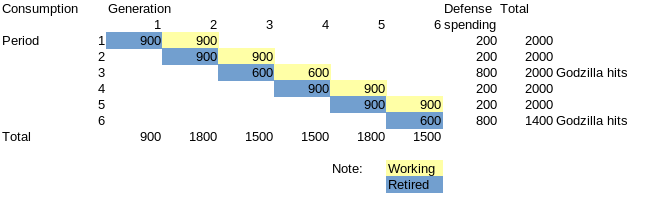

```{r setup, include=FALSE}

knitr::opts_chunk$set(echo = FALSE)

library(tidyverse)

```

## A tiny model before expansion

I made a tiny model in [the previous post](https://mitsuoxv.rbind.io/2021/05/06/gov-t-debt-is-savings-of-the-workers-for-retirement/), and showed that government debt can be a tool to bring about windfall and damage by transferring buying power from future Generations to the current one, and that windfall and damage can also be caused by population bonus and onus, and productivity growth and stagnation through interest income from holding bonds.

Assumptions were:

1. Our economy is a one factor (labor), three sector (Generation 1 and 2, Government), and closed economy. There is no capital, no business sector, no international trade, and no foreigner. Ignore financial sector as an intermediary.

1. All goods and services produced in a Period are perishable, and must be consumed in that Period, like foodstuff and entertainment, care and medicine services. There is no stock, and no investment.

1. The only role of Government is to issue and pay back bonds, of which duration is one Period, 30 years. There is no defense spending, and no taxes. 

1. The only method for Generation to save is to buy bonds.

## A tiny model after expansion

Now I would like to change 3. as below.

The roles of Government are:

- to issue and pay back bonds, of which duration is one Period, 30 years,

- to supply national defense service against the natural disasters, such as flood, earthquake and pandemic, (as I continue to assume no foreigner, there is no war against humans) and

- to collect tax.

You can see my tiny model after expansion at tiny_model2 function in [the Rmarkdown format of this post](https://github.com/mitsuoxv/blog-source/blob/master/content/post/2021-05-13-how-to-finance-war-against-godzilla/index.Rmd).

```{r}

tiny_model2 <- function(population_growth, productivity_growth, mobilize, tax_income_rate, tax_consumption_rate, saving_rate = NULL) {
  by_generation <- tibble(
    Generation = 1:7,
    population = 100 * c(1, cumprod(population_growth)),
    reproduce_rate = c(population_growth, NA)
  )
  
  by_period <- tibble(
    Period = 1:6,
    pop_retired = by_generation$population[-7],
    pop_working = by_generation$population[-1],
    productivity = 20 * c(1, cumprod(productivity_growth)),
    mobilize = mobilize,
    tax_income_rate = tax_income_rate,
    tax_consumption_rate = tax_consumption_rate
  )
  
  by_period <- by_period %>% 
    mutate(
      pop_total = pop_retired + pop_working,
      retired_ratio_pop = pop_retired / pop_total,
      GDP = productivity * pop_working,
      gov_defense_layout = GDP * mobilize,
      gov_defense_revenue = GDP * tax_income_rate + GDP * (1 - mobilize) * tax_consumption_rate,
      gov_defense_balance = gov_defense_revenue - gov_defense_layout,
      gov_defense_balance_cum = cumsum(gov_defense_balance)
    )
  
  if (is.null(saving_rate)) {
    by_period <- by_period %>% 
      mutate(saving_rate = retired_ratio_pop)
  } else {
    by_period <- by_period %>% 
      mutate(saving_rate = saving_rate)
  }
  
  by_period <- by_period %>% 
    mutate(
      disp_income = GDP - gov_defense_layout,
      consump_retired = disp_income * saving_rate ,
      consump_working = disp_income - consump_retired,
      tax_working = GDP * tax_income_rate + consump_working * tax_consumption_rate,
      tax_retired = consump_retired * tax_consumption_rate,
      percap_cons_wk = consump_working / pop_working,
      percap_cons_re = consump_retired / pop_retired,
      bond_balance = consump_retired + tax_retired - gov_defense_balance,
      income_from_interest = consump_retired + tax_retired - lag(bond_balance),
      # real interest rate per year
      annual_interest_rate = (((consump_retired + tax_retired) / (lag(bond_balance)))^(1/30) - 1) * 100,
      debt_GDP_ratio = bond_balance / GDP,
      after_tax_saving_rate = bond_balance / (GDP - tax_working)
    )

  by_generation <- by_generation %>% 
    bind_cols(
      tibble(
          consump_working = c(NA, by_period$consump_working[-11]),
          tax_working = c(NA, by_period$tax_working[-11]),
          consump_retired = c(by_period$consump_retired, NA),
          tax_retired = c(by_period$tax_retired, NA),
          income_from_work = c(NA, by_period$GDP),
          income_from_interest = c(by_period$income_from_interest, NA)
      )
    )
  
  by_generation <- by_generation %>% 
    mutate(
      consumption = consump_working + consump_retired,
      tax = tax_working + tax_retired,
      percap_consump = consumption / population,
      percap_income_from_work = income_from_work / population,
      percap_income_from_interest = income_from_interest / population,
      percap_cons_wk = consump_working / population,
      percap_cons_re = consump_retired / population,
      percap_tax = tax / population
      )
  
  list(
    by_period = by_period,
    by_generation = by_generation
  )
}

```

By expanding the model, I would like to check whether government debt, named war bond, is necessary to transfer buying power from peace time Generations to war-stricken Generations.

## War against Godzilla

Let us regard the natural disasters as Godzilla.

Suppose we know from a long history that Godzilla hits us irregularly, but on average once in every 3 Generation (90 years). We spend 10 percent of GDP to watch Godzilla in peace time Period, and spend 40 percent of GDP to fight against Godzilla in war time Period. How to fight? Imagine Government mobilizes additional 30 percent (plus peacetime 10 percent equals 40 percent in total) Working Generation, and makes them dancing and chanting "Godzilla, Ya!" without joy to calm down Godzilla. This works, and Godzilla goes away for a while. Otherwise, Godzilla will kill everybody, and no history will be written.



## Simulations

### Assume constant population and productivity through out this post

Now suppose population is constant 100 persons in every Generation, and productivity is constant 20 yen per person. So GDP is constant 2000 yen.

```{r}
# multiplier by Generation, 30 years, is constant 1 for Generation 2 to 7
population_growth <- rep(1, 6)

# multiplier by Period, 30 years, is constant 1 for Period 2 to 6
productivity_growth <- rep(1, 5) 

# Godzilla hits Period 3 and 6
mobilize <- c(0.1, 0.1, 0.4, 0.1, 0.1, 0.4)

```


```{r}
# Income tax rates change accordingly
tax_income_rate <- mobilize

# No consumption tax
tax_consumption_rate <- rep(0, 6)

model1 <- tiny_model2(population_growth, productivity_growth, mobilize, tax_income_rate, tax_consumption_rate)

model1$by_period %>% 
  select(Period, pop_total, pop_retired, pop_working, retired_ratio_pop) %>% 
  knitr::kable(
    caption = "Population by Period",
    col.names = c(
      "Period",
      "Population Total (persons)",
      "Population Retired (persons)",
      "Population Working (persons)",
      "Ratio of Retired"
      )
    )
```

### Case 1: Income tax rates move according to mobilization

Suppose income tax rates are 10 percent in peace Period, and 40 percent in war Period. No bond issue to finance a war. And suppose Generation n and Generation n-1 agree to share the produced other than defense spending by population ratio so that each person can consume equally in each Period.

```{r}
model1$by_period %>% 
  select(Period, mobilize, tax_income_rate, tax_consumption_rate, saving_rate, after_tax_saving_rate, debt_GDP_ratio, annual_interest_rate) %>% 
  knitr::kable(
    caption = "Rates and ratios by Period",
    col.names = c(
      "Period", "Mobilize (share in working population)",
      "Income tax rate",
      "Consumption tax rate",
      "After defense spending saving rate",
      "After tax saving rate",
      "Government debt to GDP ratio",
      "Interest rate (percent)"
      ),
    digits = c(0, rep(2, 7))
  )

```

Be reminded that the yen values are in Period 1 price level, and that interest rate is determined by the social contract among Generations how to share the produced. Generation 3 works and earns 2000 yen, pays tax 200 yen, consumes 900 yen and saves 900 yen by buying bonds from Government in Period 2. Generation 3 is paid back 900 yen plus some interest by Government in retired in Period 3, but the buying power of received money decreases to 600 yen due to inflation immediately after the news of Godzilla hit. That means real interest is negative 300 yen, negative 3 yen per person, annual real interest rate is -1.34 percent.

```{r}
model1$by_period %>% 
  select(Period, GDP, consump_retired, consump_working, gov_defense_layout) %>% 
  knitr::kable(
    caption = "Production and Consumption by Period",
    col.names = c(
      "Period", "GDP (yen)",
      "Consumption by Retired = Saving by Working (yen)",
      "Consumption by Working (yen)",
      "Defense spending (yen)"
    )
  )
```

While Generation 2 and 5 who are lucky enough not to be hit by Godzilla consume 18 yen per person, other Generations who are hit by Godzilla either in working or in retired consume 15 yen per person.

```{r}

model1$by_generation %>% 
  select(Generation, percap_consump, percap_cons_wk, percap_cons_re) %>% 
  knitr::kable(
    caption = "Consumption per person by Generation",
    col.names = c(
      "Generation", 
      "Consumption in Total (yen/person)",
      "Consumption in Working (yen/person)",
      "Consumption in Retired (yen/person)"
    )
  )

```


```{r}
model1$by_generation %>% 
  select(Generation, percap_income_from_work, percap_income_from_interest, percap_consump, percap_tax) %>% 
  knitr::kable(
    caption = "Income, Consumption and Tax per person by Generation",
    col.names = c(
      "Generation", 
      "Income in Working (yen/person)",
      "Income in Retired (interest income) (yen/person)",
      "Consumption in Total (yen/person)",
      "Tax payment = Defense spending (yen/person)"
    ),
    digits = c(0, rep(1, 4))

  )

```

### Case 2: Consumption tax rates move according to mobilization

Is there any change, if we tax not on income but on consumption?

Note that consumption tax rate is 1/10 in this model as well as in Japan, when we pay 11 yen in total, 1 yen for consumption tax and 10 yen for consumption.

Now note that interest rate and interest income changes to zero in any Period and Generation.

```{r}
# No income tax
tax_income_rate <- rep(0, 6)

# Consumption tax rates change accordingly
tax_consumption_rate <- c(1/9, 1/9, 4/6, 1/9, 1/9, 4/6)

model2 <- tiny_model2(population_growth, productivity_growth, mobilize, tax_income_rate, tax_consumption_rate)

model2$by_period %>% 
  select(Period, mobilize, tax_income_rate, tax_consumption_rate, saving_rate, after_tax_saving_rate, debt_GDP_ratio, annual_interest_rate) %>% 
  knitr::kable(
    caption = "Rates and ratios by Period",
    col.names = c(
      "Period", "Mobilize (share in working population)",
      "Income tax rate",
      "Consumption tax rate",
      "After defense spending saving rate",
      "After tax saving rate",
      "Government debt to GDP ratio",
      "Interest rate (percent)"
      ),
    digits = c(0, rep(2, 7))
  )

```


```{r}
model2$by_period %>% 
  select(Period, GDP, consump_retired, consump_working, gov_defense_layout) %>% 
  knitr::kable(
    caption = "Production and Consumption by Period",
    col.names = c(
      "Period", "GDP (yen)",
      "Consumption by Retired = Saving by Working (yen)",
      "Consumption by Working (yen)",
      "Defense spending (yen)"
    )
  )
```


```{r}

model2$by_generation %>% 
  select(Generation, percap_consump, percap_cons_wk, percap_cons_re) %>% 
  knitr::kable(
    caption = "Consumption per person by Generation",
    col.names = c(
      "Generation", 
      "Consumption in Total (yen/person)",
      "Consumption in Working (yen/person)",
      "Consumption in Retired (yen/person)"
    )
  )

```


```{r}
model2$by_generation %>% 
  select(Generation, percap_income_from_work, percap_income_from_interest, percap_consump, percap_tax) %>% 
  knitr::kable(
    caption = "Income, Consumption and Tax per person by Generation",
    col.names = c(
      "Generation", 
      "Income in Working (yen/person)",
      "Income in Retired (interest income) (yen/person)",
      "Consumption in Total (yen/person)",
      "Tax payment = Defense spending (yen/person)"
    ),
    digits = c(0, rep(1, 4))

  )

```

However, there is no change in consumption whether we tax income or consumption. The buying power of Generation 3, who is paid back 900 yen plus some interest by Government in retired in Period 3, is reduced to 600 yen by inflation in Case 1, and is reduced to the same 600 yen by higher consumption tax rate in Case 2.


### Case 3: Change sharing rule from 50:50 in each Period to expected 50:50 in life for each Generation

As long as I assume Generation n and n-1 agrees to share 50:50 the produced other than defense spending so that each Generation can consume equally in each Period, lucky Generation 2 and 5 can consume 18 yen per person in total, and unlucky other Generations consume 15 yen.

Let us change the assumption about Godzilla hits from irregular once in 3 Period on average to regular every 3 Period. Under this assumption, we can know Period 3 and 6 are war time Periods in advance. Then lucky Generations and unlucky Generations may agree to share

- 50:50 for Retired and Working in war time Period (both Retired and Working are war-stricken),

- 55.56:44.44 next Period (Retired is war-stricken, and Working is not) and

- 44.44:55.56 next next Period (Retired is not war-stricken, and Working will be war-stricken next Period).

No income tax. Consumption tax rates are same as Case 2.

```{r}
# saving rate to make equal consumption in life of each Generation
saving_rate <- c(10/18, 8/18, 6/12, 10/18, 8/18, 6/12)

# No income tax
tax_income_rate <- rep(0, 6)

# Consumption tax rates change accordingly
tax_consumption_rate <- c(1/9, 1/9, 4/6, 1/9, 1/9, 4/6)

model3 <- tiny_model2(population_growth, productivity_growth, mobilize, tax_income_rate, tax_consumption_rate, saving_rate)

model3$by_period %>% 
  select(Period, mobilize, tax_income_rate, tax_consumption_rate, saving_rate, after_tax_saving_rate, debt_GDP_ratio, annual_interest_rate) %>% 
  knitr::kable(
    caption = "Rates and ratios by Period",
    col.names = c(
      "Period", "Mobilize (share in working population)",
      "Income tax rate",
      "Consumption tax rate",
      "After defense spending saving rate",
      "After tax saving rate",
      "Government debt to GDP ratio",
      "Interest rate (percent)"
      ),
    digits = c(0, rep(2, 7))
  )


```


```{r}
model3$by_period %>% 
  select(Period, GDP, consump_retired, consump_working, gov_defense_layout) %>% 
  knitr::kable(
    caption = "Production and Consumption by Period",
    col.names = c(
      "Period", "GDP (yen)",
      "Consumption by Retired = Saving by Working (yen)",
      "Consumption by Working (yen)",
      "Defense spending (yen)"
    )
  )
```


```{r}

model3$by_generation %>% 
  select(Generation, percap_consump, percap_cons_wk, percap_cons_re) %>% 
  knitr::kable(
    caption = "Consumption per person by Generation",
    col.names = c(
      "Generation", 
      "Consumption in Total (yen/person)",
      "Consumption in Working (yen/person)",
      "Consumption in Retired (yen/person)"
    )
  )

```


```{r}
model3$by_generation %>% 
  select(Generation, percap_income_from_work, percap_income_from_interest, percap_consump, percap_tax) %>% 
  knitr::kable(
    caption = "Income, Consumption and Tax per person by Generation",
    col.names = c(
      "Generation", 
      "Income in Working (yen/person)",
      "Income in Retired (interest income) (yen/person)",
      "Consumption in Total (yen/person)",
      "Tax payment = Defense spending (yen/person)"
    ),
    digits = c(0, rep(1, 4))

  )

```

Consumption in total is 16 yen per person for every Generation. Inter-Generation equity is achieved!

### Case 4: Set consumption tax rate constant at 4/16, and issue war bond in war time Period

As production is 20 yen per person and consumption in total is 16 yen per person, let us set consumption tax rate at 4/16 in every Period. This means Government issue war bond in war time Period, pays back some parts and roll over other parts in peace time Period.

```{r}
# saving rate to make equal consumption in life of each Generation
saving_rate <- c(10/18, 8/18, 6/12, 10/18, 8/18, 6/12)

# No income tax
tax_income_rate <- rep(0, 6)

# Constant consumption tax rates over Periods
tax_consumption_rate <- rep(4/16, 6)

model4 <- tiny_model2(population_growth, productivity_growth, mobilize, tax_income_rate, tax_consumption_rate, saving_rate)

model4$by_period %>% 
  select(Period, mobilize, tax_income_rate, tax_consumption_rate, saving_rate, after_tax_saving_rate, debt_GDP_ratio, annual_interest_rate) %>% 
  knitr::kable(
    caption = "Rates and ratios by Period",
    col.names = c(
      "Period", "Mobilize (share in working population)",
      "Income tax rate",
      "Consumption tax rate",
      "After defense spending saving rate",
      "After tax saving rate",
      "Government debt to GDP ratio",
      "Interest rate (percent)"
      ),
    digits = c(0, rep(2, 7))
  )


```


```{r}
model4$by_period %>% 
  select(Period, GDP, consump_retired, consump_working, gov_defense_layout) %>% 
  knitr::kable(
    caption = "Production and Consumption by Period",
    col.names = c(
      "Period", "GDP (yen)",
      "Consumption by Retired (yen)",
      "Consumption by Working (yen)",
      "Defense spending (yen)"
    ),
    digits = rep(0, 5)
  )
```


```{r}
model4$by_period %>% 
  select(Period, gov_defense_layout, gov_defense_revenue,
         gov_defense_balance, gov_defense_balance_cum) %>% 
  knitr::kable(
    caption = "Defense spending and tax revenue by Period",
    col.names = c(
      "Period", "Defense spending (yen)",
      "Tax revenue (yen)",
      "Fiscal balance (yen)",
      "Cumulative fiscal balance (yen)"
    ),
    digits = rep(0, 5)
  )
```

```{r}

model4$by_generation %>% 
  select(Generation, percap_consump, percap_cons_wk, percap_cons_re) %>% 
  knitr::kable(
    caption = "Consumption per person by Generation",
    col.names = c(
      "Generation", 
      "Consumption in Total (yen/person)",
      "Consumption in Working (yen/person)",
      "Consumption in Retired (yen/person)"
    ),
    digits = rep(0, 4)
  )

```


```{r}
model4$by_generation %>% 
  select(Generation, percap_income_from_work, percap_income_from_interest, percap_consump, percap_tax) %>% 
  knitr::kable(
    caption = "Income, Consumption and Tax per person by Generation",
    col.names = c(
      "Generation", 
      "Income in Working (yen/person)",
      "Income in Retired (interest income) (yen/person)",
      "Consumption in Total (yen/person)",
      "Tax payment (yen/person)"
    ),
    digits = c(0, rep(1, 4))

  )

```

Consumption is not changed, but interest income is changed to zero. War bond replaces interest income's role of transferring buying power across Generations.

### Case 5: Godzilla comes back sooner than expected

Now let us change back the assumption about Godzilla hits from regular every 3 Period to irregular once in 3 Period on average. We can say consumption in total is expected to be equal for every Generation, but may turn out to be different.

So far we supposed Period 3 and 6 are war time Periods. Let us suppose Period 3 and 4 are war time Periods instead.

```{r}
# war time in Period 3 and 4
mobilize <- c(0.1, 0.1, 0.4, 0.4, 0.1, 0.1)

# Constant consumption tax rates over Periods
tax_consumption_rate <- rep(4/16, 6)

# No income tax
tax_income_rate <- rep(0, 6)

# saving rate to make equal consumption in life of each Generation
saving_rate <- c(10/18, 8/18, 6/12, 10/12, 14/18, 12/18)

model5 <- tiny_model2(population_growth, productivity_growth, mobilize, tax_income_rate, tax_consumption_rate, saving_rate)

model5$by_period %>% 
  select(Period, mobilize, tax_income_rate, tax_consumption_rate, saving_rate, after_tax_saving_rate, debt_GDP_ratio, annual_interest_rate) %>% 
  knitr::kable(
    caption = "Rates and ratios by Period",
    col.names = c(
      "Period", "Mobilize (share in working population)",
      "Income tax rate",
      "Consumption tax rate",
      "After defense spending saving rate",
      "After tax saving rate",
      "Government debt to GDP ratio",
      "Interest rate (percent)"
      ),
    digits = c(0, rep(2, 7))
  )

```


```{r}
model5$by_period %>% 
  select(Period, GDP, consump_retired, consump_working, gov_defense_layout) %>% 
  knitr::kable(
    caption = "Production and Consumption by Period",
    col.names = c(
      "Period", "GDP (yen)",
      "Consumption by Retired (yen)",
      "Consumption by Working (yen)",
      "Defense spending (yen)"
    ),
    digits = rep(0, 5)
  )
```


```{r}
model5$by_period %>% 
  select(Period, gov_defense_layout, gov_defense_revenue,
         gov_defense_balance, gov_defense_balance_cum) %>% 
  knitr::kable(
    caption = "Defense spending and tax revenue by Period",
    col.names = c(
      "Period", "Defense spending (yen)",
      "Tax revenue (yen)",
      "Fiscal balance (yen)",
      "Cumulative fiscal balance (yen)"
    ),
    digits = rep(0, 5)
  )
```

```{r}

model5$by_generation %>% 
  select(Generation, percap_consump, percap_cons_wk, percap_cons_re) %>% 
  knitr::kable(
    caption = "Consumption per person by Generation",
    col.names = c(
      "Generation", 
      "Consumption in Total (yen/person)",
      "Consumption in Working (yen/person)",
      "Consumption in Retired (yen/person)"
    ),
    digits = rep(0, 4)
  )

```


```{r}
model5$by_generation %>% 
  select(Generation, percap_income_from_work, percap_income_from_interest, percap_consump, percap_tax) %>% 
  knitr::kable(
    caption = "Income, Consumption and Tax per person by Generation",
    col.names = c(
      "Generation", 
      "Income in Working (yen/person)",
      "Income in Retired (interest income) (yen/person)",
      "Consumption in Total (yen/person)",
      "Tax payment (yen/person)"
    ),
    digits = c(0, rep(1, 4))
  )

```

We can keep consumption in total to be equal for every Generation, if Generation 4 and beyond are confident Godzilla does not hit more than once in 3 Periods on average, and agree to new share rule, though Generation 5 working in Period 4 the second consecutive war time Period may not be able to endure only 2 yen per person consumption. Additional war bonds can't help Generation 5 in Period 4, as total consumption is constrained to 6 yen per person on average. If Generation 5 can't endure 2 yen per person consumption in Period 4, and is afraid Godzilla may come back in Period 5, this share rule will collapse in Period 4.

## It is inter-Generation equity, stupid

From above simulations, what can I say?

- War bond is not essential to spread war burdens across Generations. Even if war bond is not issued, interest income from holding bonds play the role of spreading burdens across Generations.

- That said, war bond is an orderly manner to spread war burdens intra-Generation. While tax hike hurts the poor, war bond collects money from the rich.

- Agreed share rule between Retired and Working Generations is essential to achieve inter-Generation equity.

The reason why I expand the model, and to check the role of war bond is because I read briefly the book ["Look deep into the fiscal crisis" (Japanese)](https://www.amazon.co.jp/%E8%B2%A1%E6%94%BF%E5%8D%B1%E6%A9%9F%E3%81%AE%E6%B7%B1%E5%B1%A4-%E5%A2%97%E7%A8%8E%E3%83%BB%E5%B9%B4%E9%87%91%E3%83%BB%E8%B5%A4%E5%AD%97%E5%9B%BD%E5%82%B5%E3%82%92%E5%95%8F%E3%81%86-NHK%E5%87%BA%E7%89%88%E6%96%B0%E6%9B%B8-%E5%B0%8F%E9%BB%92-%E4%B8%80%E6%AD%A3/dp/4140884495), written by Kazumasa Oguro, a former Ministry of Finance officer, now a economics professor and a famous fiscal soundness advocate, and published by a subsidiary of NHK.

He explains government debt situation by comparing to household debt. I feel uneasy, because government debt creates mostly both bond holders' credit and Government's debt in house (a country), while household debt creates, well, only debt in house.

He also teaches us a history lesson that Japanese Government Bond defaulted after Japan lost the World War II, when government debt, including war bonds, reached 200 percent of GDP. I suspect the cause of default is not high debt ratio to GDP but the government regime change brought by losing war and being occupied. [The man in the high castle](https://en.wikipedia.org/wiki/The_Man_in_the_High_Castle) may have not seen Japanese Government Bond default.

Although there are many other things I disagree with him on, like the effects of quantitative easing by the Bank of Japan and the necessity to raise consumption tax rates before BOJ achieves 2 percent inflation target, I think he may or may not be right about pension system and inter-Generation equity issues.

To fiscal soundness advocates like him, I would like to say, "The issue is not fiscal soundness. It is inter-Generation equity, stupid."
