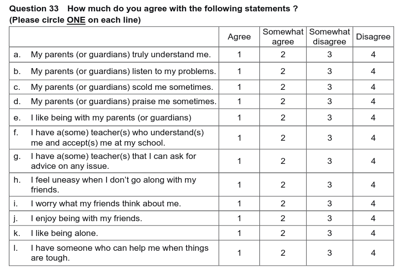

```{r setup, include=FALSE}
knitr::opts_chunk$set(echo = FALSE)

library(tidyverse)

theme_set(theme_light())
```

## A surprise result from a survey

I have found [a tweet](https://twitter.com/kodai_kusano/status/1635856303049555968) which refers to a survey result that high school students in the U.S. feel uneasy when they don't go along with their friends, more than those in Japan, China and Korea.

Simply unbelievable! The source is [a survey published by National Institution For Youth Education of Japan in 2018 (Japanese)](https://www.niye.go.jp/kenkyu_houkoku/contents/detail/i/126/). You can read questionnaires [here](https://www.niye.go.jp/kanri/upload/editor/126/File/10_questionnaire_e.pdf) in English, and find Question 33 like below.



## My hypothesis is that confusion has caused a surprise

Question 33 is about relations with parents, teachers and friends. Left ("Agree") means positive and Right ("Disagree") means negative in most questionnaires, except h and i where Left and Right is reversed. You can see response results by country in columns and question in rows below. 

As participants respond by question order, they tend to repeat the same response in successive questions. So some auto-correlation or momentum is moving vertically in below chart. My hypothesis is the U.S. participants are so positive and quick to answer that some of them may have missed the reversed meanings in questions h and i.

However, I am not sure. Korean participants who are more positive than the U.S. didn't fall in the same trap in questions h and i. Difference of questionnaire structure by language may have affected.

```{r read_data, message=FALSE}
# content/post/2023-03-15-questionnaires-can-be-confusing-by-order/

results <- read_csv("q33results.csv")
```

```{r plot, fig.width=6, fig.height=12}
results |> 
  mutate(question = str_to_lower(question)) |> 
  pivot_longer(Japan:Korea, names_to = "country") |> 
  mutate(
    country = factor(country,
                     levels = c("US", "Japan", "China", "Korea")),
    res2 = factor(res2,
                  levels = c("Agree", "Somewhat agree",
                             "Somewhat disagree", "Disagree"))
    ) |> 
  ggplot(aes(res2, value)) +
  geom_col(aes(fill = res2)) +
  scale_y_continuous(breaks = c(0, 50)) +
  scale_fill_brewer(palette = "RdBu") +
  facet_grid(rows = vars(question), cols = vars(country)) +
  labs(x = NULL, y = "Percent") +
  theme(
    axis.text.x = element_text(angle = 90),
    strip.background = element_blank(),
  strip.text = element_text(color = "black"),
    legend.position = "none"
    )
```

