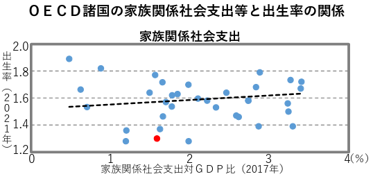

```{r setup, include=FALSE}
knitr::opts_chunk$set(echo = FALSE, fig.width=6, fig.height=6)

library(tidyverse)
library(lubridate)

theme_set(theme_light())

library(OECD)
library(countrycode)

library(janitor)
library(ggrepel)
```

## Assertions in the Economic and Fiscal Advisory Council material

The headline of [Asahi Shinbun article on April 27, 2023 (Japanese)](https://www.asahi.com/articles/ASR4V72G8R4VULFA01D.html) caught my eye, which is "5 trillion increase in public expenditure for family is estimated to increase population by 0.9 to 1.8 million persons in 2060." This article let me know the estimate on page 3 titled "Possible utilization of EBPM to analyze policy effects" in [the Economic and Fiscal Advisory Council material presented by 4 private-sector members on April 26, 2023 (Japanese)](https://www5.cao.go.jp/keizai-shimon/kaigi/minutes/2023/0426/shiryo_01_2.pdf).

It shows the figure below, and warns us that correlation is not causality in the footnote. Title is "Correlation between public expenditure for family and fertility rate in OECD countries." X-axis is percent ratio of public expenditure for family to GDP in 2017, and Y-axis is fertility rate in 2021. Red point is Japan. There are 34 points.



Then, they make a causal statement, "1 percent of GDP (5 trillion yen) increase in public expenditure for family leads to 0.05 to 0.1 increase in fertility rate. This estimate is based on 30 OECD countries data since 2010".

I have got confused. Do they think this figure, which does not show confidence interval, suggests correlation? And, even if it does, do they think they can morph correlation into causality by more samples from multiple years? So I have decided to get data from OECD.stat.

## Replicated figure with some tweaks

```{r get_data}
# 38 countries
oecd_countries <- c("ISR", "LUX", "NLD", "GRC", "ISL", "LVA", "SVN", "FRA", "POL", "TUR", "ESP", "BEL", "MEX", "IRL", "CHE", "FIN", "CHL", "CAN", "KOR", "NZL", "AUS", "HUN", "USA", "GBR", "AUT", "SWE", "DNK", "SVK", "CZE", "COL", "JPN", "NOR","CRI", "LTU", "DEU", "EST", "PRT", "ITA")

# "OAVG" OECD average
family <- get_dataset(
  "FAMILY",
  filter = list(c(oecd_countries, "OAVG"), "TOTAL", c("FAM1", "FAM3")),
  start_time = 1990, end_time = 2021
  ) |> 
  clean_names() |> 
  mutate(
    obs_value = parse_number(obs_value),
    time = parse_number(time)
    )

# "OECD" OECD average
family_expenditure <- get_dataset(
  "SOCX_AGG",
  filter = list("10", "5", "0", "0", "PCT_GDP", c(oecd_countries, "OECD")),
  start_time = 1980, end_time = 2021
  ) |> 
  clean_names() |> 
  mutate(
    obs_value = parse_number(obs_value),
    time = parse_number(time)
    )
```

```{r avail_2021}
avail_2021 <- family |> 
  filter(ind == "FAM1", time == 2021, !is.na(obs_value)) |> 
  mutate(country = countrycode(cou, "iso3c", "country.name")) |> 
  pull(country)
```

I find there are just `r length(avail_2021)` countries of which fertility rates of 2021 are available in OECD.stat.

```{r avail_2021_print}
avail_2021
```

Probably they got 2021 data from other sources. I decide to change Y-axis from 2021 to 2020 to cover all 38 OECD countries data.

```{r fer_vs_exp}
# fertility rate vs public family expenditure; point
fer_vs_exp <- family |> 
  filter(ind == "FAM1", time == 2020) |> 
  select(cou, fertility = obs_value) |> 
  mutate(cou = if_else(cou == "OAVG", "OECD", cou)) |> 
  left_join(family_expenditure |> 
              filter(time == 2017) |> 
              select(cou = country, fam_exp = obs_value),
            by = "cou") |> 
  mutate(country = cou |> 
           countrycode("iso3c", "country.name") |> 
           coalesce("OECD average")
         )

fer_vs_exp2 <- fer_vs_exp |>
  filter(!cou %in% c("OECD"))

fer_vs_exp2 |> 
  distinct(country) |> 
  pull(country) # 38 countries
```

I plot the replicated chart below with confidence interval. It is uncertain whether the slope is positive or negative.

```{r fer_vs_exp2}
fer_vs_exp2 |> 
  ggplot(aes(fam_exp, fertility)) +
  geom_point(aes(color = cou == "JPN"), show.legend = FALSE) +
  geom_smooth(method = "lm") +
  geom_text_repel(aes(color = cou == "JPN", label = country)
                  , show.legend = FALSE) +
  scale_color_manual(values = c("gray50", "red")) +
  coord_cartesian(xlim = c(0, 4), ylim = c(0, 3)) +
  labs(x = "Ratio of public expenditure for family to GDP\n(percent, 2017)",
       y = "Fertility rate\n(percent, 2020)",
       title = "No clear correlation between public expenditure for family\nand fertility rate in one year",
       caption = "Source: OECD.stat")
```

It is difficult to say there is a positive or negative correlation.

```{r fer_exp_model}
fer_exp_model <- lm(fertility ~ fam_exp, data = fer_vs_exp2)
summary(fer_exp_model)
```

## Narrower confidence interval from multiple years data?

I turn to multiple years data from 2010 to 2020 for fertility rate, and 2007 to 2017 for public expenditure for family, as I assume 3 year ago public expenditure for family effects fertility rate this year. Confidence interval is now much narrower, as the sample size is larger.

```{r fer_vs_exp_multi}
fer_vs_exp_multi <- family |> 
  filter(ind == "FAM1") |> 
  select(cou, time, fertility = obs_value) |> 
  mutate(cou = if_else(cou == "OAVG", "OECD", cou)) |> 
  right_join(family_expenditure |>
              select(cou = country, time, fam_exp = obs_value),
            by = c("cou", "time")) |> 
  group_by(cou) |> 
  arrange(time) |> 
  mutate(fam_exp_lag = lag(fam_exp, 3)) |> 
  ungroup() |> 
  mutate(country = cou |> 
           countrycode("iso3c", "country.name") |> 
           coalesce("OECD average")
         )

fer_vs_exp_multi2 <- fer_vs_exp_multi |>
  filter(!cou %in% c("OECD"), time >= 2010, time <= 2020)

fer_vs_exp_multi2 |> 
  ggplot(aes(fam_exp_lag, fertility)) +
  geom_path(aes(color = country)) +
  geom_smooth(method = "lm") +
  coord_cartesian(xlim = c(0, 4), ylim = c(0, 3)) +
  labs(x = "Ratio of public expenditure for family to GDP\n(percent, 3 years ago)",
       y = "Fertility rate\n(percent, current year)",
       color = NULL,
       title = "Apparent positive correlation between public expenditure for family and\nfertility rate from 2010-2020 data. Is it real?",
       subtitle = "Each colored line is a country.",
       caption = "Source: OECD.stat") +
  theme(legend.position = "none")
```

```{r fer_exp_multi_model}
fer_exp_multi_model <- lm(fertility ~ fam_exp, data = fer_vs_exp_multi2)
```

The slope is estimated as `r coef(fer_exp_multi_model)[2] |> round(3)`, and close to their assertion of 0.05 to 0.1. P-value is close to 0.05.

```{r fer_exp_multi_model_summary}
summary(fer_exp_multi_model)
```

## It's a bad idea to treat cross-country multiple-year data as independent points

Should I agree with them? Absolutely not. Each colored line does not show a positive slope. The positive slope of the fitted line comes mainly from cross-country differences. And there is no positive correlation between public spending for family and fertility rate either in Japan or OECD average in the figure below.

```{r oecd_jpn}
oecd_jpn <- fer_vs_exp_multi |> 
  filter(cou %in% c("OECD", "JPN")) |> 
  filter(!is.na(fam_exp_lag), !is.na(fertility))

oecd_jpn |> 
  ggplot(aes(fam_exp_lag, fertility)) +
  geom_path(aes(color = country)) +
  geom_label_repel(aes(label = time),
             data = oecd_jpn |> 
               filter(time %in% c(1990, 2020))) +
  coord_cartesian(xlim = c(0, 4), ylim = c(0, 3)) +
  labs(x = "Ratio of public expenditure for family to GDP\n(percent, 3 years ago)",
       y = "Fertility rate\n(percent, current year)",
       color = NULL,
       title = "No positive correlation over years between public spending for family\nand fertility rate either in Japan or OECD average",
       caption = "Source: OECD.stat") +
  theme(legend.position = "top")
```

## Causality does not come from data

Still they can argue fertility rate would have fallen deeper without an increase in public expenditure for family. This counterfactual argument should be based on some assumed causal mechanism. Increasing the number of samples does not morph correlation into causality, anyway. Do not try to increase the number of samples in a weird way.
