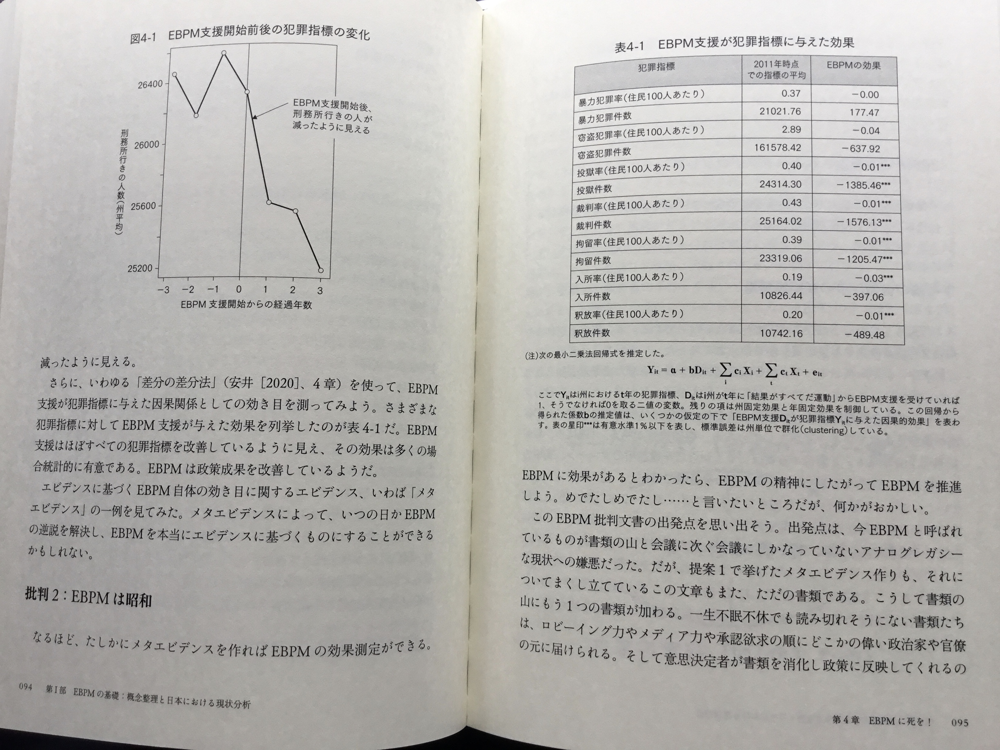

## Assist Prof Narita did a meta-analysis on the effectiveness of EBPM

[Assistant Professor Narita of Yale University](https://economics.yale.edu/people/yusuke-narita) wrote an article in [a book on EBPM (Evidence-Backed Policy-Making) which was published in Japan in December 2022](https://www.amazon.co.jp/-/en/%E5%A4%A7%E7%AB%B9%E6%96%87%E9%9B%84/dp/429611526X). In his article, he did a meta-analysis on the effectiveness of EBPM by checking whether [RFI (Results First Initiative)](https://www.pewtrusts.org/en/projects/archived-projects/results-first-initiative), which supported states in the U.S. from 2010 to 2023 by EBPM methods and is now concluded, really helped states reduce crimes. From his article, I quote two pages below:



"***" in the right table means p-value is less than 0.01. This table looks too good to be true to me. So I try to reproduce his meta-analysis.

```{r setup, include=FALSE}
knitr::opts_chunk$set(
  echo = FALSE,
  fig.width = 6,
  fig.asp = 0.618,
  out.width = '70%',
  fig.align = 'center'
  )

library(tidyverse)
library(rethinking)
library(dagitty)

theme_set(theme_light())
```

## This is not a natural experiment, contrary to his assertion

He asserts this is a natural experiment, as some states joined RFI and others didn't.

If joining states are selected at random by some accidents, it is a natural experiment. In this case states voluntarily joins RFI, so this is not a natural experiment. Z (states' willingness to join RFI) is a confound between X (RFI support) and Y (an outcome) like below. Even if X is associated with Y, it may be caused by Z.

```{r rfi_dag}
rfi_dag <- dagitty("dag{
  X <- Z -> Y
  X -> Y
}")

coordinates(rfi_dag) <- list(x = c(X = 0, Z = 1, Y = 2),
                            y = c(X = 1, Z = 0, Y = 1))

drawdag(rfi_dag)
```

X: RFI support based on EBPM

Y: Outcome of crimes

Z: Governor or State Congress

For now, however, I pretend this is a natural experiment, and move on.

## Which states joined RFI, and when?

I get the info on which states joined RFI and when from [this page](https://www.pewtrusts.org/en/projects/archived-projects/results-first-initiative/where-we-work). As there must be 27 states, I count Salt Lake County, Utah as Utah state. Although some California counties joined in 2013, I count California in 2016 when California state joined.

```{r states_join}
states_join <- tribble(
  ~state, ~year_join,
  "North Carolina", "December 2017",
  "Alabama", "August 2017",
  "Minnesota", "June 2015",
  "California", "January 2016",
  "Mississippi", "December 2012",
  "Colorado", "summer 2014",
  "New Mexico", "2011",
  "Illinois", "fall of 2011",
  "New York", "late 2011",
  "Iowa", "May 2011",
  "Alaska", "March 2015",
  "Nevada", "August 2014",
  "Oregon", "January 2012",
  "Connecticut", "March 2011",
  "Pennsylvania", "March 2017",
  "Rhode Island", "March 2013",
  "Delaware", "August 2015",
  "Utah", "June 2017",
  "Florida", "October 2015",
  "Texas", "December 2011",
  "Idaho", "February 2011",
  "Vermont", "November 2011",
  "Kansas",  "2011",
  "West Virginia", "July 2014",
  "Massachusetts", "March 2012",
  "Wisconsin", "fall 2013 Several months later",
  "Montana", "May 2017"
) |> 
  mutate(year_join = parse_number(year_join)) |> 
  arrange(state)

states_join |> 
  mutate(state = state |> 
           fct_reorder(year_join) |> 
           fct_rev()) |> 
  ggplot(aes(year_join, state)) +
  geom_point() +
  scale_x_continuous(breaks = 2011:2017) +
  labs(x = NULL, y = NULL,
       title = "27 states joined RFI from 2011 to 2017") +
  theme(panel.grid.minor = element_blank())
```

## Replicate the quoted figure

Statistically significant at 0.01 items in the quoted table above are all U.S. prison data, like prisoners, sentenced prisoners, custody population, admissions and releases. So, I have prepared those data in [my GitHub repo](https://github.com/mitsuoxv/us-prison). For simplicity, I use only prisoners here.

Judging from the quoted figure, I guess he regards 17 states which joined between 2011 and 2014 as treatment group, and the rest 33 states as control group. I replicate the quoted figure like below in the left, and plot both treatment and control groups in Y-axis including zero in the right.

```{r prisoners, message=FALSE, out.width='50%', fig.align='default', fig.asp=1}
prisoners <- read_csv("https://raw.githubusercontent.com/mitsuoxv/us-prison/main/prisoners.csv")

prisoners_long <- prisoners |> 
  pivot_longer(-state, names_to = "year", values_to = "prisoners") |> 
  mutate(year = as.numeric(year)) |> 
  arrange(state, year)

states_join_upto_2014 <- states_join |> 
  filter(year_join <= 2014)

prisoners_long2 <- prisoners_long |> 
  left_join(states_join_upto_2014, by = "state") |> 
  mutate(
    group = if_else(is.na(year_join), "Control", "Treatment"),
    year_join = coalesce(year_join, 2012),
    diff_year = year - year_join
  )

prisoners_long2 |> 
  filter(group == "Treatment") |> 
  filter(between(diff_year, -3, 3)) |> 
  group_by(diff_year) |> 
  summarize(prisoners = mean(prisoners)) |> 
  ggplot(aes(diff_year, prisoners)) +
  geom_line() +
  geom_vline(xintercept = 0, lty = 2) +
  scale_x_continuous(breaks = -3:3) +
  labs(x = "years before or after the joined year",
       title = "Average number of prisoners in treatment group (17 states)") +
  theme(panel.grid.minor = element_blank())

prisoners_long2 |> 
  filter(between(diff_year, -3, 3)) |> 
  group_by(group, diff_year) |> 
  summarize(prisoners = mean(prisoners), .groups = "drop") |> 
  ggplot(aes(diff_year, prisoners)) +
  geom_line(aes(color = group)) +
  geom_vline(xintercept = 0, lty = 2) +
  scale_x_continuous(breaks = -3:3) +
  expand_limits(y = 0) +
  labs(x = "years before or after the joined year",
       title = "Average number of prisoners per state") +
  theme(panel.grid.minor = element_blank(),
        legend.position = "top")
```

## Replicate the row of prisoners in the quoted table

He asserts he has used DiD (Difference-in-Difference) method to make the quoted table, writes standard errors are clustered by state with the two-way (state and year) fixed effect model equation in the footnote of the table.

As he refers to the 4th chapter in [Primer for causal inference by Shota Yasui](https://www.amazon.co.jp/%E5%8A%B9%E6%9E%9C%E6%A4%9C%E8%A8%BC%E5%85%A5%E9%96%80%E3%80%9C%E6%AD%A3%E3%81%97%E3%81%84%E6%AF%94%E8%BC%83%E3%81%AE%E3%81%9F%E3%82%81%E3%81%AE%E5%9B%A0%E6%9E%9C%E6%8E%A8%E8%AB%96-%E8%A8%88%E9%87%8F%E7%B5%8C%E6%B8%88%E5%AD%A6%E3%81%AE%E5%9F%BA%E7%A4%8E-%E5%AE%89%E4%BA%95-%E7%BF%94%E5%A4%AA/dp/4297111179), he must have used miceadds::lm.cluster() to get clustered standard errors. So I also use miceadds::lm.cluster().

As the quoted figure shows -3 to 3 years from the joined year of the states which joined from 2011 to 2014, I use data from 2008 to 2017, and set "rfi" 0 in the years upto the joined year and 1 in the years beyond the joined year. Alaska, Delaware, Florida and Minnesota which joined in 2015 get 1 in "rfi" in 2016 and 2017, and California which joined in 2016 gets 1 in "rfi" in 2017. So the treatment group is now 22 states, and the control group is 28 states.

Please look at the last line, "rfi". Estimate is -248, and p-value is 0.709. This does not look like the quoted table.

```{r 2fe, message=FALSE}
dat <- prisoners_long |> 
  left_join(states_join, by = "state") |> 
  filter(between(year, 2008, 2017)) |> 
  mutate(
    year_join = coalesce(year_join, Inf),
    rfi = if_else(year > year_join, 1, 0),
    state = factor(state),
    year = factor(year)
    ) |> 
  select(!year_join)

miceadds::lm.cluster(formula = prisoners ~ state + year + rfi,
                     data = dat, cluster = "state") |> 
  summary()
```

So I try the one-way (state) fixed effect model. Now, estimate is -1415, and p-value is 0.019. Although p-value is still larger than 0.01, this looks similar to the quoted table.

The problem is this is not DiD. Negative estimate merely reflects downward trend in nearly all states.

```{r 1fe}
miceadds::lm.cluster(formula = prisoners ~ state + rfi,
                     data = dat, cluster = "state") |> 
  summary()
```

## Conclusion

While I try to reproduce his work, I find that he wrongly recognized the data came from a natural experiment, and that he failed to do DiD, probably due to a coding error. Is he so careless? Maybe. Or maybe not. I suspect he may have tested us. If we are easily deceived by statistical junks, EBPM can be harmful. After all, he titled his article as "Wish Death of EBPM!"

This is my second post to criticize Assist. Prof. Narita's work. First one is [here](https://mitsuoxv.rbind.io/2022/10/08/does-democracy-cause-slower-economic-growth-in-the-21st-century/).
